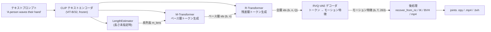
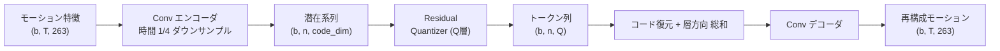
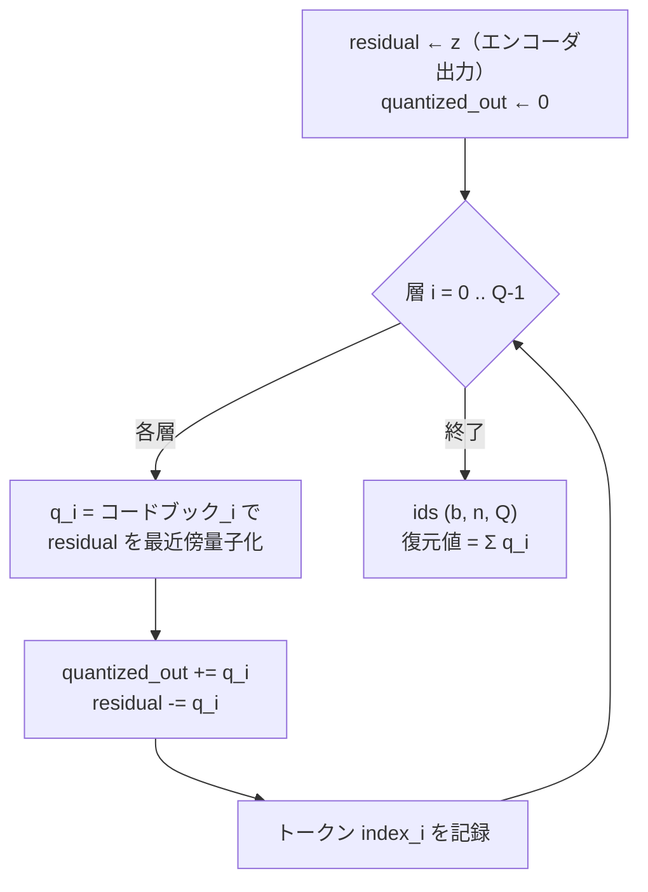
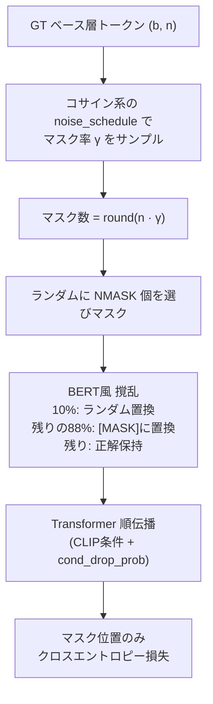
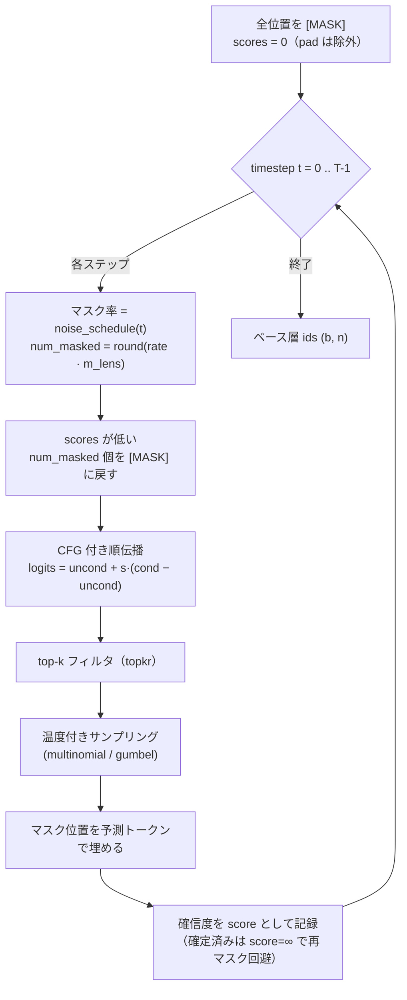
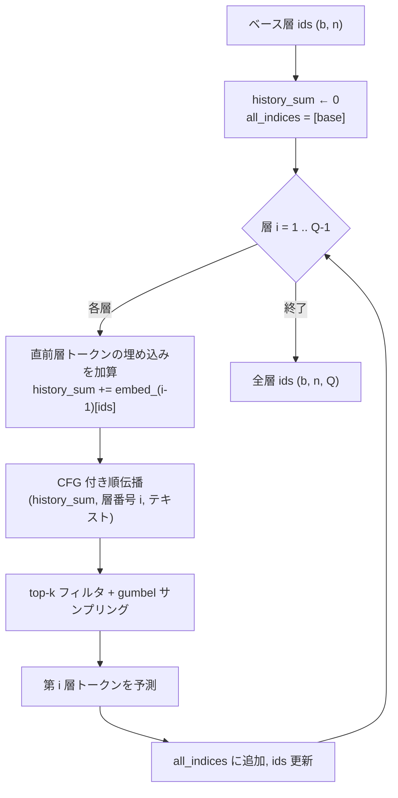
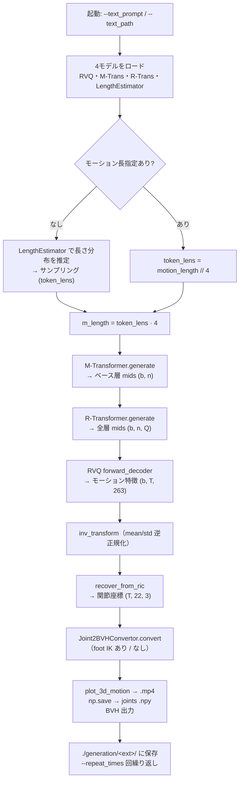
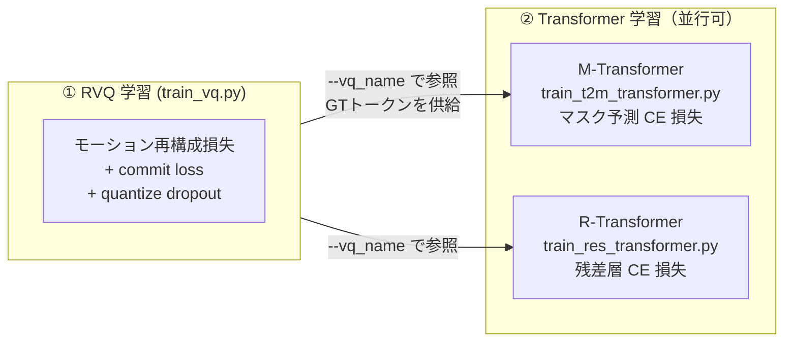
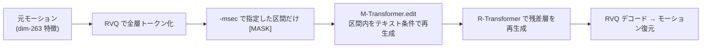

# MoMask アルゴリズム解説

本ドキュメントは MoMask（*Generative Masked Modeling of 3D Human Motions*, CVPR 2024）の
テキスト→モーション生成アルゴリズムを、フローチャートを交えて整理したものである。
記述はすべて本リポジトリの実装（`gen_t2m.py`, `models/vq/`, `models/mask_transformer/`）に基づく。

> 図は [Mermaid](https://mermaid.js.org/) 記法。GitHub・VS Code（Markdown Preview Mermaid 拡張）等でそのまま描画される。

---

## 1. 概要

MoMask は **3 つのモデルのカスケード** でテキストからモーションを生成する。

| 略称 | モデル | 役割 | 実装 |
|------|--------|------|------|
| **RVQ-VAE** | Residual Vector-Quantized VAE | モーション ↔ 多層離散トークン の相互変換 | `models/vq/model.py` (`RVQVAE`) |
| **M-Transformer** | Masked Transformer | テキスト → **ベース層**トークンを並列・反復生成 | `models/mask_transformer/transformer.py` (`MaskTransformer`) |
| **R-Transformer** | Residual Transformer | ベース層 → **残差層**トークンを層ごとに生成 | 同上 (`ResidualTransformer`) |

補助モデルとして **LengthEstimator**（`models/vq/model.py`）がテキストからモーション長を推定する。
すべてのモデルは **CLIP (`ViT-B/32`) のテキスト埋め込み** で条件づけられる。

中核となる発想は 2 つ：

1. **Residual Quantization** — モーションを 1 層ではなく `Q=6` 層の離散トークン列で表現し、
   下位層が上位層の量子化誤差（残差）を順に表現することで、少ないコードブックで高精度に再構成する。
2. **Generative Masked Modeling** — ベース層トークンを自己回帰ではなく、
   BERT 風のマスク予測を**反復**することで並列生成する（拡散モデルに似た反復精緻化）。

---

## 2. 全体アーキテクチャ



データ表現の流れ（HumanML3D の場合）：

```
テキスト → CLIP埋め込み(512次元)
        → 系列長 n = m_length / 4 （RVQで時間方向 1/4 にダウンサンプル）
        → トークン ids 形状 (b, n, Q=6)
        → モーション特徴 (b, T, 263)         ※ 263 = HumanML3D の dim-263 特徴ベクトル
        → 関節座標 (T, 22, 3)                 ※ recover_from_ric
```

KIT-ML の場合は特徴次元 251、関節数 21。

---

## 3. RVQ-VAE（モーションのトークン化）

### 3.1 構造



### 3.2 残差量子化の核心（`models/vq/residual_vq.py`）

各層 `i` は「直前までで表現しきれなかった残差」を量子化する。これを `Q` 層繰り返す。



- 復元は単純に全層のコードを **加算** する（`forward_decoder`: `x = x_d.sum(dim=0)`）。
- 学習時の重要テクニック **quantize dropout**（`quantize_dropout_prob`, 既定 0.2）：
  確率的に後半の層を無効化（index = -1）して学習する。これにより上位層（特にベース層）が
  単独でも意味を持つよう促され、M-Transformer がベース層だけを扱えるようになる。
- コードブックは EMA 更新（`QuantizeEMAReset`, `models/vq/quantizer.py`）。

---

## 4. M-Transformer（ベース層トークンの生成）

ベース層（`ids[..., 0]`）のみを担当する。生成は自己回帰ではなく **反復マスク予測**。

### 4.1 学習（`MaskTransformer.forward`, transformer.py:242）



- 学習目標はマスクした位置のトークン ID を当てること（`cal_performance`）。
- `cond_drop_prob`（M は既定 0.1）でテキスト条件をランダムに落とし、
  推論時の **Classifier-Free Guidance (CFG)** を可能にする。

### 4.2 推論（`MaskTransformer.generate`, transformer.py:328）

全トークン [MASK] から開始し、`timesteps` 回かけて「自信のある位置を確定 → 残りを再マスク」を繰り返す。



ポイント：
- `cond_scale`（CFG 強度）, `time_steps`（反復回数）, `temperature`, `topkr`（top-k 閾値）が主要ハイパラ。
- マスク率はステップが進むほど減少 → 確定トークンが単調に増えていく（拡散の逆過程に類似）。
- score が高い（モデルが確信した）トークンほど後段ステップで保持されやすい。

---

## 5. R-Transformer（残差層トークンの生成）

ベース層 `ids[..., 0]` を入力に、残差層 `1 .. Q-1` を **層ごとに順番に**生成する（`generate`, transformer.py:893）。



- M-Transformer と違い反復は行わず、**1 層 1 パス**で全位置を並列予測する。
- `share_weight`（学習時 `--share_weight`）で層間の射影／埋め込み重みを共有可能。
- 推論時の CFG 強度は `gen_t2m.py` 内で `cond_scale=5` 固定。

---

## 6. 推論パイプライン全体（`gen_t2m.py`）



出力（`./generation/<ext>/`）：
- `joints/` … 関節座標 `.npy`（`(T, 22, 3)`、`_ik` 付きは foot IK 適用版）
- `animations/` … スティックフィギュア `.mp4` と `.bvh`

---

## 7. 学習パイプライン

**学習順序が重要**：RVQ を必ず先に学習し、そのトークンを使って 2 つの Transformer を学習する
（M と R は同時並行で学習可能）。



代表的な学習コマンド（README より）：

```bash
# ① RVQ
python train_vq.py --name rvq_name --gpu_id 0 --dataset_name t2m \
    --batch_size 256 --num_quantizers 6 --max_epoch 50 \
    --quantize_dropout_prob 0.2 --gamma 0.05

# ② M-Transformer
python train_t2m_transformer.py --name mtrans_name --gpu_id 0 \
    --dataset_name t2m --batch_size 64 --vq_name rvq_name

# ② R-Transformer
python train_res_transformer.py --name rtrans_name --gpu_id 0 \
    --dataset_name t2m --batch_size 64 --vq_name rvq_name \
    --cond_drop_prob 0.2 --share_weight
```

---

## 8. 主要ハイパーパラメータ対応表

| パラメータ | 役割 | 既定/標準値 | 関係モデル |
|------------|------|-------------|------------|
| `num_quantizers` (`Q`) | 残差量子化の層数 | 6 | RVQ |
| `nb_code` | コードブックサイズ | 512 | RVQ |
| `quantize_dropout_prob` | 量子化層ドロップ率 | 0.2 | RVQ |
| `time_steps` | M の反復マスク予測回数 | — | M-Trans |
| `cond_scale` | CFG 強度 | — (R は 5 固定) | M / R |
| `temperature`, `topkr` | サンプリング温度 / top-k 閾値 | — | M / R |
| `cond_drop_prob` | 条件ドロップ率（CFG 用） | M:0.1 / R:0.2 | M / R |
| `share_weight` | R の重み共有 | — | R-Trans |
| `motion_length` | 生成フレーム数（20fps, 4の倍数に丸め） | 未指定で自動推定 | 推論 |

---

## 9. 編集（Temporal Inpainting, `edit_t2m.py`）

既存モーションの一部区間だけをテキストで再生成する機能。
M-Transformer 段でマスクベース編集を行い、その後 R-Transformer で系列全体の残差トークンを再生成する。



- `-msec` はマスク区間を比率（`0.4,0.7`）またはフレーム index で指定。
- 元モーションは HumanML3D dim-263 特徴である必要がある
  （独自データは `utils/motion_process.py` の `process_file` で変換）。
  サンプル: `example_data/000612.npy`。

---

## 参考

- 論文: *MoMask: Generative Masked Modeling of 3D Human Motions* (CVPR 2024), https://arxiv.org/abs/2312.00063
- プロジェクトページ: https://ericguo5513.github.io/momask
- リポジトリ構成・コマンドの詳細は [`../CLAUDE.md`](../CLAUDE.md) を参照。
</content>
