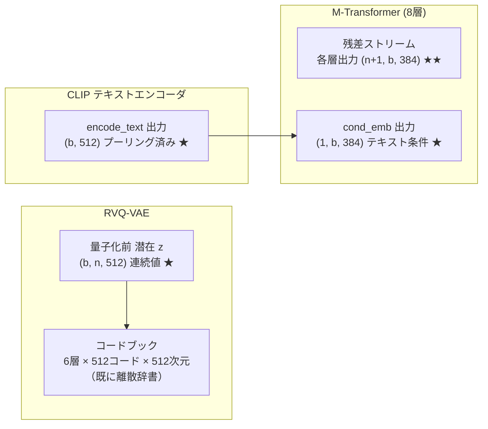
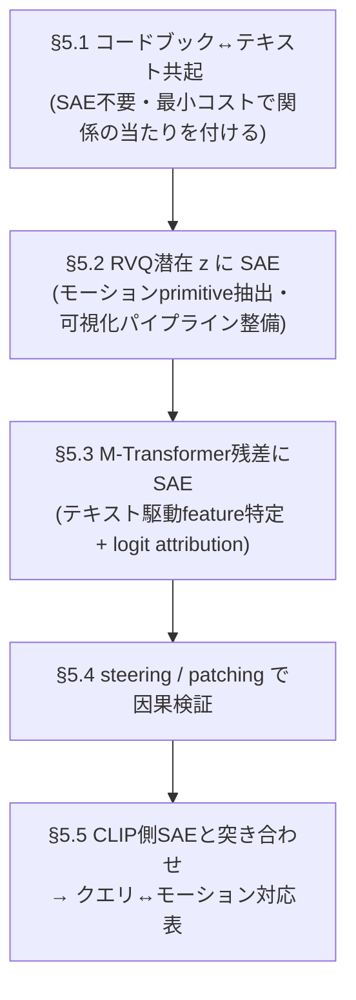

# MoMask に SAE を適用した特徴量抽出・モーション↔クエリ関係分析の可能性調査

本ドキュメントは、**SAE（Sparse Autoencoder / 疎なオートエンコーダ、機構的解釈可能性で用いる辞書学習）** を
MoMask に適用して

1. 解釈可能な特徴量（feature）を抽出できるか
2. モーションとテキストクエリの関係を分析できるか
3. 何がボトルネックになるか・実際に何が可能か

を、本リポジトリの実装（`models/vq/`, `models/mask_transformer/`）に基づいて整理したものである。
アーキテクチャ全体は [`momask_algorithm.md`](momask_algorithm.md) を前提とする。

> **注意**: ここでの SAE は「次元削減用のただの AE」ではなく、活性（activation）を
> **過完備（overcomplete）かつ疎な辞書**に分解し、各次元（feature）が単義的（monosemantic）な
> 概念に対応することを狙う、Anthropic の dictionary learning 系の手法を指す。

---

## 1. 結論（要約）

| 問い | 結論 |
|------|------|
| SAE で特徴量抽出は可能か | **可能**。連続値の活性が取れる箇所が複数ある（RVQ 量子化前の潜在 `z`、M/R-Transformer の残差ストリーム、CLIP テキスト埋め込み）。 |
| モーション↔クエリの関係分析は可能か | **部分的に可能**。ただし MoMask のテキスト条件は **CLIP のプーリング済み単一ベクトル**であり、**単語単位の表現を持たない**。よって「どの単語がどのフレームに対応するか」のような細粒度のアライメント分析は構造的に困難。「クエリ全体 ↔ モーション特徴」の粗い関係なら分析可能。 |
| 最大のボトルネック | ① テキストが単一トークンに圧縮されている（単語粒度なし）② モーション表現が VQ で離散化されている ③ 学習データ・トークン数が LLM 比で桁違いに少ない ④ 標準 `nn.TransformerEncoder` 利用のため sublayer 単位の hook が貼りにくい。 |

---

## 2. SAE を当てられる候補点（活性の棚卸し）

MoMask 内で「連続値ベクトルの活性」が取り出せる場所と、その次元・データ量。
（数値は配布チェックポイント `checkpoints/t2m/...` の設定: RVQ `code_dim=nb_code=512, Q=6`、Transformer `latent_dim=384, n_layers=8`）

| # | 候補点 | 実装上の場所 | 形状 | 連続/離散 | SAE 向き | 主な用途 |
|---|--------|--------------|------|-----------|----------|----------|
| A | **RVQ 量子化前の潜在 `z`** | `ResidualVQ.forward` の入力 `x`（`models/vq/residual_vq.py:99`）= エンコーダ出力 | `(b, n, 512)` | 連続 | ◎ | モーション側の連続「プリミティブ」抽出 |
| B | **RVQ 各層の残差 `residual`** | `residual_vq.py:146` のループ内 | `(b, n, 512)` | 連続 | ○ | 残差階層ごとの特徴（粗→細）の解析 |
| C | **RVQ コードブック** | `ResidualVQ.codebooks`（`residual_vq.py:59`） | `(6, 512, 512)` | 離散辞書 | △ | **既に辞書**。SAE 不要で直接解析可（§5.1） |
| D | **M-Transformer 残差ストリーム** | `seqTransEncoder` 各層出力（`transformer.py:238`） | `(n+1, b, 384)` | 連続 | ◎ | 解釈可能 feature 抽出の本命。テキスト条件と相互作用後の表現 |
| E | **cond_emb 出力（条件トークン）** | `transformer.py:228` | `(1, b, 384)` | 連続 | ○ | クエリ表現の分解。位置 0 の特殊トークン |
| F | **CLIP テキスト埋め込み** | `encode_text`（`transformer.py:194`） | `(b, 512)` | 連続 | ○ | クエリ側の概念抽出（ただし MoMask 非依存） |

★の数は SAE 適用の素直さ・解釈可能性の高さの目安。**本命は D（Transformer 残差ストリーム）と A（RVQ 潜在）**。

---

## 3. 「モーション↔クエリ関係」を分析するために必要なもの vs MoMask の現実

機構的解釈で「条件↔出力の関係」を分析する典型手法と、MoMask での可否：

| 手法 | 概要 | MoMask での可否 |
|------|------|-----------------|
| **特徴抽出（SAE）** | 残差ストリームに SAE を学習し単義 feature を得る | ✅ 可能（候補点 D, A） |
| **Activation patching** | クエリ A の活性をクエリ B の forward に差し込み出力変化を見る | ✅ 可能。cond トークン（位置 0）や残差ストリームを差し替えればよい |
| **Feature steering** | SAE feature 方向を活性に加算し生成モーションの変化を観測 | ✅ 可能。`cond_emb` 出力や残差に加算（§5.4） |
| **Logit attribution** | feature → 出力トークン logit への寄与を測る | ✅ 可能。出力は離散トークン logit（`output_process`） |
| **単語↔フレームのアテンション解析** | どの単語がどのフレームを駆動するか | ⚠️ **困難**。テキストは単一プーリングベクトルで単語表現が無い（§4-①） |
| **Cross-attention 解析** | テキストトークン × モーショントークンの注意重み | ⚠️ 不可。MoMask は cross-attention でなく、cond を 1 トークンとして self-attention に prepend する方式 |

つまり **「クエリ全体としての概念 ↔ モーション特徴」の関係は分析できる**が、
**「単語レベルの細かいアライメント」は MoMask の設計上、表現として存在しない**。

---

## 4. ボトルネック

### ① テキスト条件が「単一プーリングベクトル」である（最大の制約）
`encode_text`（`transformer.py:194-198`）は `clip_model.encode_text` の戻り値（EOS トークンの
プーリング済み `(b, 512)`）をそのまま条件に使う。M-Transformer ではこれを 1 トークンに射影して
系列に prepend する（`transformer.py:228, 231`）。R-Transformer も同様。

- 帰結: **単語単位のテキスト表現が momask 内に存在しない**。
  「"left hand" がどのフレームに効いたか」のような細粒度アライメントは、表現がそもそも無いので抽出不能。
- 回避策: CLIP の **トークン単位特徴**（`clip_model.encode_text` を改造して per-token 出力を取得、
  または `token_embedding + transformer` の最終層を pool 前に取り出す）を別途取り出して
  SAE/相関分析する。ただしこれは「MoMask が実際に使っている情報」ではなく CLIP 側の解析になる点に注意。

### ② モーション表現が VQ で離散化されている
SAE は連続活性の分解が前提。MoMask の主表現は離散トークン `(b, n, Q)`。

- 量子化**前**の連続潜在 `z`（候補点 A）と各層**残差**（B）は連続なので SAE 適用可。
- ただし `z` は直後に最近傍コードに丸められるため、`z` 上の連続的な feature と
  実際に生成に使われる離散コードの対応はズレうる（量子化誤差ぶん情報が失われる）。
- コードブック（C）は**既に 512 エントリの離散辞書**なので、SAE をかけるより
  「コード ↔ テキスト共起」「コード ↔ 関節運動」を直接集計するほうが素直（§5.1）。

### ③ データ・トークン規模が LLM 比で桁違いに小さい
- HumanML3D: 動作 ≈ 1.4 万、テキスト ≈ 2.3 万。1 動作の平均トークン長 ≈ 49（フレーム 196 を時間 1/4）。
- 総トークン活性 ≈ 1.4万 × 49 ≈ **70 万**程度。LLM の SAE 学習（数十億トークン）とは桁が違う。
- 帰結: 巨大な辞書（数万 feature）は過学習しやすい。**辞書サイズは latent_dim×4〜16（384→1.5k〜6k 程度）に抑える**、
  data augmentation（ミラーリング等）やマルチエポックでの活性収集が現実的。

### ④ 標準 `nn.TransformerEncoder` 使用で sublayer hook が貼りにくい
`transformer.py:110-117` は PyTorch 標準の `nn.TransformerEncoderLayer/Encoder`。

- 取り出しやすいのは **各 EncoderLayer の出力**（forward hook）。
- 一方 LLM SAE で定番の「attention 出力後・MLP 出力後の残差ストリーム」を sublayer 単位で
  取るには、`TransformerEncoderLayer` の内部に hook を貼るか自前実装に差し替える必要がある。
- まずは **layer 出力（残差ストリーム）への forward hook** で十分始められる。

### ⑤ 解釈の「正解ラベル」が弱い
- LLM はテキストで feature を説明しやすいが、モーション feature の意味付けは
  関節軌道の可視化・人手ラベル・テキスト共起頻度に頼ることになり、評価が主観的になりやすい。
- 緩和策: HumanML3D の**テキストアノテーションを feature 説明のラベル源**として活用（§5.3）。

### ⑥ 凍結 CLIP / 小モデルゆえの限界
- CLIP は凍結（`transformer.py` でロード時 eval）。テキスト側の表現は固定で、momask 学習で変化しない。
- Transformer は 8 層・384 次元と小さく、層あたりの「回路」も浅い。深い多段回路の解析対象としては薄い。

---

## 5. 具体的に可能なこと（実験プラン）

ボトルネックを踏まえ、**コスパ順**に実施可能な分析を示す。

### 5.1 ベースライン: コードブック ↔ テキスト共起解析（SAE 不要・即着手可）
コードブック（候補点 C）は既に離散辞書。SAE を学習する前に、まずこれを直接解析する。

- 全 HumanML3D 動作を `RVQVAE.encode`（`models/vq/model.py`）でトークン化。
- 各コード `c`（層 q, index k）について、その**コードが出現した動作のテキスト**を集める。
- コード ↔ 単語の **PMI / TF-IDF** を計算 → 「コード k はよく "jump" と共起」等を抽出。
- 同時に、そのコードだけを decode して関節運動を可視化（コード単体の意味付け）。
- → SAE なしで「モーション素片 ↔ 言葉」の粗い関係が得られる。**最初にやるべき検証**。

### 5.2 SAE 学習①: RVQ 量子化前潜在 `z` 上（モーション側 feature）
- `ResidualVQ.forward` 入力 `z`（候補点 A、`(b,n,512)`）を全データで収集。
- 過完備 SAE（辞書 2k〜6k、L1 もしくは TopK 疎性）を学習。
- 得た feature を ① 関節運動で可視化、② §5.1 と同様にテキスト共起でラベル付け。
- → 「左腕を上げる」「しゃがむ」「速い」等の**連続的モーションプリミティブ**を期待。

### 5.3 SAE 学習②: M-Transformer 残差ストリーム上（本命・関係分析）
- 候補点 D（各層出力 `(n+1,b,384)`）に forward hook を貼り活性収集。
  位置 0 は cond トークン、位置 1.. はモーショントークン。
- 層ごとに SAE 学習（まずは中間層 1 つ、例: 4 層目から）。
- 分析:
  - **feature → 出力トークン logit の attribution**: feature 方向を `output_process`（`transformer.py:239`）に
    通し、どのコードトークンを押し上げるかを測る。
  - **クエリ依存性**: 同じモーション位置の feature 活性を、テキスト条件あり/なし（CFG の uncond パス、
    `force_mask=True`、`transformer.py:315`）で比較 → 「テキストに駆動される feature」を特定。
  - **cond トークン位置（候補点 E）の feature**: クエリ概念がどう符号化されるかを分解。

### 5.4 介入実験: Feature steering と activation patching
- **Steering**: SAE feature 方向を `cond_emb` 出力（`transformer.py:228`）や残差に加算して生成し、
  モーションがどう変わるかを観測（因果的検証）。
- **Patching**: クエリ A の cond トークン活性をクエリ B の生成に差し込み、出力モーションの変化量で
  「その活性が担う運動概念」を測る。MoMask は cond が独立 1 トークンなので差し替えが容易。

### 5.5 クエリ側: CLIP テキスト空間の SAE（補助）
- 候補点 F（`(b,512)`）に SAE を学習し、テキスト概念 feature を得る。
- §5.3 のモーション側 feature と **同一データでの活性相関**を取り、
  「テキスト feature ↔ モーション feature」の対応表を作る → これが
  **「クエリとモーションの関係」の定量的成果物**になる。
- 注意: これは CLIP の表現解析であり、momask の単語粒度欠如（§4-①）を CLIP 側で補う位置づけ。

---

## 6. 推奨ロードマップ

- **まず §5.1** で「そもそもコード ↔ 言葉に関係があるか」を確認（数日規模、既存 API のみ）。
- 関係が見えたら §5.2→§5.3 と SAE を導入。可視化・ラベル付けの基盤（§5.1 の共起集計）を流用できる。
- 介入（§5.4）まで行って初めて「相関でなく因果」を主張できる。

---

## 7. 実装メモ（着手時の注意）

- **活性の取り出し**: M/R-Transformer は標準 `nn.TransformerEncoder`。
  `for i, layer in enumerate(model.seqTransEncoder.layers): layer.register_forward_hook(...)` で
  層出力を取得するのが最短（§4-④）。RVQ 潜在は `ResidualVQ.forward` 入力を返す薄いラッパで取得。
- **正規化**: モーション特徴は mean/std 正規化済み（`inv_transform`、`gen_t2m.py`）。
  feature の関節可視化時は逆正規化 → `recover_from_ric` を通す。
- **テキスト条件あり/なしの対比**には既存の CFG 経路（`force_mask` / `mask_cond`、`transformer.py:200-208, 315`）が
  そのまま使える。新規実装は不要。
- **データ拡張**: HumanML3D は左右ミラーリングで実質倍。データ量の少なさ（§4-③）を一部緩和できる。
- **辞書サイズ**: まず `latent_dim×4`（≈1536）程度から。疎性は TopK（k=16〜32）が L1 より調整が楽。

---

## 8. まとめ

- **特徴量抽出は可能**。連続活性を取れる箇所（RVQ 潜在 `z`、Transformer 残差ストリーム、CLIP 埋め込み）が
  あり、SAE を素直に適用できる。
- **モーション↔クエリ関係分析も可能だが粒度に制約**。MoMask のテキスト条件は単一プーリングベクトルなので、
  **「クエリ全体 ↔ モーション特徴」の粗い関係**は分析できるが、**単語↔フレームの細粒度アライメントは
  構造上存在しない**（最大のボトルネック）。
- **最初の一手はコードブック↔テキスト共起解析（§5.1）**。SAE 無しで関係の有無を確かめ、
  その基盤の上に RVQ 潜在 → Transformer 残差の順で SAE を導入するのが堅実。
- 主なボトルネックは ①テキスト単語粒度の欠如 ②VQ 離散化 ③データ規模 ④標準 Transformer 実装の hook 制約 ⑤解釈ラベルの弱さ。

---

## 参考
- MoMask 実装詳細・各モデルの役割: [`momask_algorithm.md`](momask_algorithm.md)
- Sparse Autoencoder / dictionary learning（機構的解釈可能性）: Anthropic *Towards Monosemanticity* 系の研究
- 本調査の対象コード: `models/vq/residual_vq.py`, `models/vq/model.py`, `models/mask_transformer/transformer.py`
</content>
</invoke>
